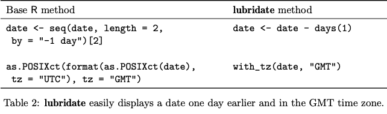

```{r setup, include=FALSE, cache=TRUE}
knitr::opts_chunk$set(echo = FALSE, warning = FALSE, error = FALSE, 
                      message = FALSE, cache = TRUE)
```

```{r, echo=FALSE, fig.align='center'}
knitr::include_graphics('lubridate.png')
```

## Package Overview: Lubridate
* The main purpose of Lubridate is to make working with dates and times simpler.
* Methods for dealing with date-time objects must be robust to changes in time such as leap years, time zones, daylight-savings time, seasons, and many other unique aspects of time. 
* With this package one can manipulate, parse, and extract date/time data as well as perform algebraic operations
  * Grouping these tools by common purpose is helpful
* Uses a very memorable syntax that makes working with Lubridate very easy
* Examples of function groups
  * Parsing Dates
  * Manipulating Dates
  * Rounding Dates
  * Time Zones
  * Durations
  * Intervals
* Main authors of Lubridate are Garrett Grolemund and Hadley Wickham. 
* Lubridate currently operates on version 1.7.9.

## Necessary Packages
```{r, message=FALSE}
library(tidyverse)
library(knitr)
library(lubridate)
```

## Examples of Usage{.tabset}
### as_date
as_date(): this function converts an object into a date or date-time
```{r}
vect <- c("04/26/2008", "12/25/1990", "01/01/2000")
class(vect)
# %Y-%m-%d is the default format, the following line fails 
vect_dt <- as_date(vect)
vect_dt <- as_date(vect, format = "%m/%d/%Y")
vect_dt
class(vect_dt)
```

### Get/Set Functions
```{r}
x <- as_date("2005-05-10 5:17:42")
day(x)
day(x) <- 17
day(x)
x
minute(x)

y <- ("2005-05-10 5:17:42")
hour(y)
second(y)
minute(y)
month(y)
year(y)
```

### Date "Math"
```{r, warning = FALSE}
y <- as_date("2018-10-26")
z <- y + days(2)
z

reg_time <- now(tzone = 'EST')
daylight_svngs <- reg_time + hours(1)
reg_time
daylight_svngs

#adding durations and intervals together
start_2020 <- ymd_hms("2020-01-01 12:00:00")
new_week <- ddays(7)
first_week_2020 <- start_2020 + new_week
first_week_2020

tm_corona <- ymd_hm("2020-03-12 11:45", tz = "US/Eastern")
tm_now <- now()
difftime(tm_now, tm_corona, units = "weeks")

christmas <- ymd("2020-12-25")
new_year <- ymd("2021-01-01")
interval <- new_year - christmas

z <- interval/ddays(1)
z
```

## Graph Using Time Data{.tabset}
### Code
```{r, message=FALSE, results=FALSE}
str(lakers$date)
lakers$date <- ymd(lakers$date)
str(lakers$date)
lakers$game_type <- as.factor(lakers$game_type)
home_away <<- ggplot(lakers, aes(x = date, y = 0)) + 
  geom_point(aes(color = game_type)) + 
  labs(title = "2008 Home and Away Games for the Lakers Over Time") +
  xlab("Date of Game") +
  ylab("") +
  scale_y_continuous(breaks = seq(0, 1, 1)) + 
  scale_color_discrete("Home or Away Game")
  theme(axis.text.y = element_blank()
)

```

### Graph
```{r}
home_away
```

## Our Opinion
### Pros: 
* Lubridate is the perfect package for working with date-time data. Nearly all the benefits of lubridate involve making date-time data manipulation much easier. Here are the key benefits that lubridate offers as a package in R.
* Much better than other R functions for manipulating and performing operations on time data. 
  * Easier to identify and parse date-time data
  * Easier to extract specific components of a date-time, like year, month, days, hours, minutes
  * Easier to perform accurate calculations with date-time
  * Easier to handle time zones and daylight savings time
* Time data is made it’s own date type, depending on the method used
* Uses an intuitive user interface
* Syntax is much more easy to use and more memorable
* Includes functions that apply to every combination of how dates can be represented
* Useful for comparing time data to each other

```{r, echo=FALSE}

```

[Link to Download Graphic](https://www.jstatsoft.org/article/view/v040i03/v40i03.pdf)

### Cons: 
* Beyond compatibility with other packages in R, lubridate does not have many cons in terms of functionality. Created as a solution to dealing with date-time data, lubridate serves to do just that.
* For its default setting Lubridate uses time instants expressed in UTC, which isn’t associated with a time zone and does not take into account daylight savings
* There isn’t complete compatibility between lubridate and dplyr, particularly in older versions of the softwares
  * Ex: dplyr can’t deal with the duration class, would need to convert to numeric

## Citations
1. https://lubridate.tidyverse.org
2. https://rawgit.com/rstudio/cheatsheets/master/lubridate.pdf
3. https://data.library.virginia.edu/working-with-dates-and-time-in-r-using-the-lubridate-package/
4. https://cran.r-project.org/web/packages/lubridate/vignettes/lubridate.html#
5. https://cran.r-project.org/web/packages/lubridate/lubridate.pdf
6. https://www.rdocumentation.org/packages/lubridate/versions/1.7.9
7. https://www.google.com/url?sa=i&url=https%3A%2F%2Flubridate.tidyverse.org%2F&psig=AOvVaw0tGvtqCQacuObJXBoGqht5&ust=1602202802988000&source=images&cd=vfe&ved=0CAIQjRxqFwoTCNDo8dnco-wCFQAAAAAdAAAAABAD

